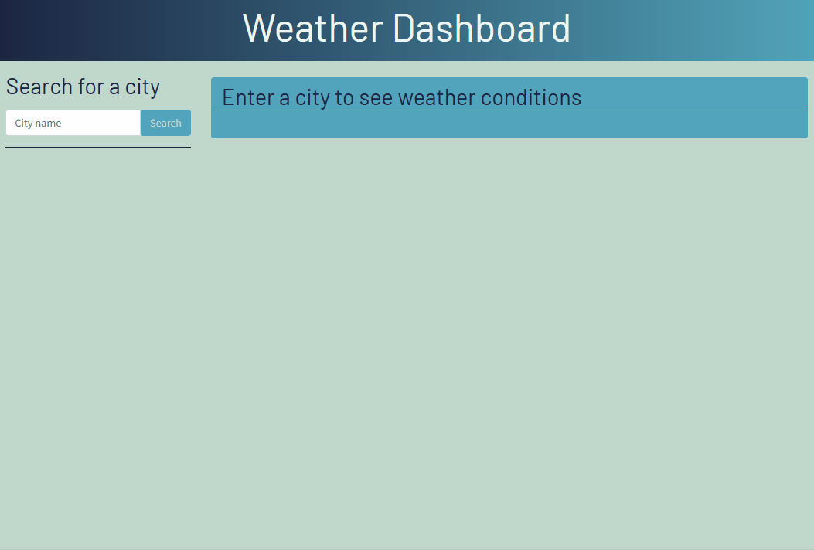

# Weather Dashboard

## About the Project
Find weather conditions for cities with a simple search. The Weather Dashboard will return the city that you searched, the date, temperature, wind speed, and humidity. A 5-day forecast is also created with the same information displayed. Previous searches are logged to a button list that allows you to search for those cities with just a click.

### Features
* View current weather conditions and 5-day forecast for any city
* View previous cities with buttons that record your search history
* Search history is logged to local storage

### Built With
* Bootstrap v4.6
* jQuery
* moment.js
* openweathermap.org

## Geting Started
1. Visit [this page](https://awoelf.github.io/weather-dashboard/) to view the app in your browser.
2. Enter a city into the search bar and click the search button.
3. Search for more cities, or click the buttons below the search bar to view past cities that you searched for.
4. When you refresh, your search history will remain!

### Prerequisite
Install a modern internet browser and connect to the internet.

## License
Distributed unter the MIT license. See `LICENSE.txt` for more information.

## Contact
Alexis Woelffer - [awoelf@outlook.com](mailto:awoelf@outlook.com)

[![LinkedIn][linkedin-shield]][linkedin-url]

<!-- Links and images -->
[linkedin-shield]: https://img.shields.io/badge/-LinkedIn-black.svg?style=for-the-badge&logo=linkedin&colorB=555
[linkedin-url]: https://linkedin.com/in/alexis-w-dev

(<a href="#readme-top">back to top</a>)
